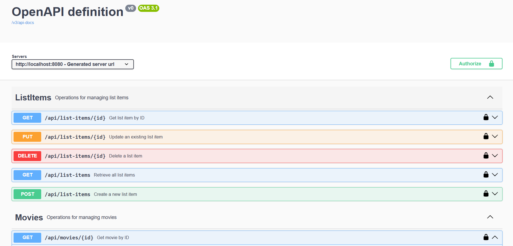
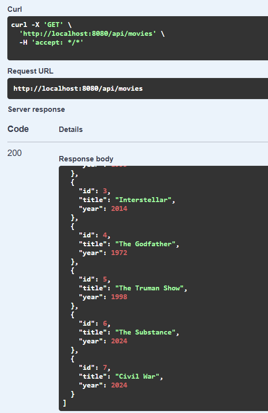
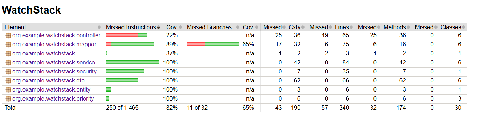
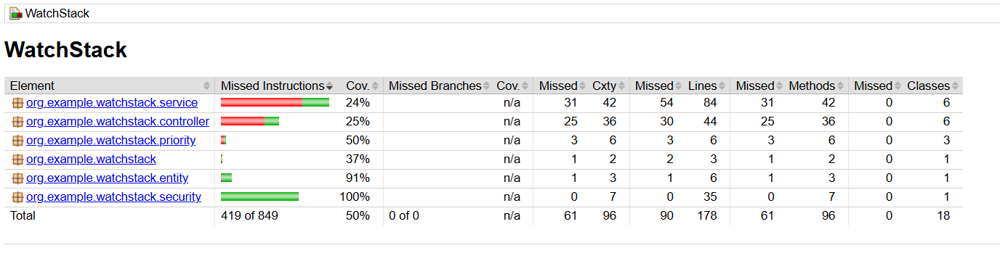

**WatchStack**

An application for logging watched movies, creating custom lists, and managing your watchlist.

---

## 📚 Table of Contents

1. [Introduction](#introduction)
2. [Tech Stack](#tech-stack)
3. [Setup & Installation](#setup--installation)
4. [Configuration](#configuration)
5. [Database Migrations (Flyway)](#database-migrations-flyway)
6. [Running with Docker](#running-with-docker)
7. [API Documentation](#api-documentation)

    * [Users](#users)
    * [Movies](#movies)
    * [Custom Lists](#custom-lists)
    * [List Items](#list-items)
    * [Watched Entries](#watched-entries)
    * [Watchlist Items](#watchlist-items)
8. [Security & Roles](#security--roles)
9. [Testing](#testing)
10. [Screenshots](#screenshots)
11. [Design Patterns Used](#design-patterns-used)

---

## Introduction

WatchStack to aplikacja umożliwiająca:

* Rejestrowanie obejrzanych filmów (`watched_entries`).
* Tworzenie własnych list (`custom_lists`).
* Zarządzanie watchlistą (`watchlist_items`).

---

## Tech Stack

* **Java 23**
* **Spring Boot 3.4.3** (Web, Data JPA, Security, Validation)
* **PostgreSQL**
* **Flyway** (migracje bazy)
* **Docker & Docker Compose**
* **Swagger / Springdoc OpenAPI**
* **JUnit 5, Mockito, Testcontainers** (unit & integration tests)
* **Lombok**

---

## Setup & Installation

1. **Clone repo:**

   ```bash
   git clone https://github.com/KrystianRucki/WatchStack.git
   cd watchstack
   ```
2. **Build:**

   ```bash
   mvn clean package
   ```

---

## Configuration

W pliku `src/main/resources/application.properties`:

```properties
spring.application.name=WatchStack
spring.datasource.url=jdbc:postgresql://localhost:5432/watchstackdb
spring.datasource.username=admindb
spring.datasource.password=mypassword
spring.jpa.hibernate.ddl-auto=update
spring.jpa.show-sql=true
spring.datasource.driver-class-name=org.postgresql.Driver

spring.jpa.properties.hibernate.dialect=org.hibernate.dialect.PostgreSQLDialect
spring.flyway.enabled=true
spring.flyway.locations=db/migration
spring.flyway.baseline-on-migrate=true
spring.flyway.schemas=public
spring.flyway.baseline-version=1
spring.flyway.baseline-description="Watchstack database baseline"
logging.level.org.flywaydb=DEBUG
```

---

## Database Migrations (Flyway)

W katalogu `src/main/resources/db/migration` umieść plik:

* `V1__init_schema.sql` – tworzenie tabel.

Flyway automatycznie wykryje i wykona migracje przy starcie aplikacji.

---

## Running with Docker

W katalogu głównym znajduje się `docker-compose.yml`:

```yaml
version: '3.8'

services:
  app:
    build: .
    ports:
      - "8080:8080"
    container_name: springboot-app
    depends_on:
      - db
    environment:
      SPRING_DATASOURCE_URL: jdbc:postgresql://db:5432/watchstackdb
      SPRING_DATASOURCE_USERNAME: admindb
      SPRING_DATASOURCE_PASSWORD: mypassword
      SPRING_JPA_HIBERNATE_DDL_AUTO: update
      SPRING_JPA_SHOW_SQL: "true"

  db:
    image: postgres:15
    container_name: postgres-db
    environment:
      POSTGRES_DB: watchstackdb
      POSTGRES_USER: admindb
      POSTGRES_PASSWORD: mypassword
    ports:
      - "5433:5432"
    volumes:
      - pgdata:/var/lib/postgresql/data

volumes:
  pgdata:
```

Uruchamianie:

```bash
docker-compose up --build
```

---

## API Documentation

Po uruchomieniu dostępne pod: **[http://localhost:8080/swagger-ui.html](http://localhost:8080/swagger-ui.html)**

## Users

* `GET /api/users` — pobierz wszystkich użytkowników
* `GET /api/users/{id}` — pobierz użytkownika po ID
* `POST /api/users` — utwórz nowego użytkownika
* `PUT /api/users/{id}` — zaktualizuj istniejącego użytkownika
* `DELETE /api/users/{id}` — usuń użytkownika po ID

## Movies

* `GET /api/movies` — pobierz wszystkie filmy
* `GET /api/movies/{id}` — pobierz film po ID
* `POST /api/movies` — dodaj nowy film
* `PUT /api/movies/{id}` — zaktualizuj dane filmu
* `DELETE /api/movies/{id}` — usuń film po ID

## Custom Lists

* `GET /api/custom-lists` — pobierz wszystkie listy
* `GET /api/custom-lists/{id}` — pobierz listę po ID
* `POST /api/custom-lists` — utwórz nową listę
* `PUT /api/custom-lists/{id}` — zaktualizuj listę
* `DELETE /api/custom-lists/{id}` — usuń listę po ID

## List Items

* `GET /api/list-items` — pobierz wszystkie elementy list
* `GET /api/list-items/{id}` — pobierz element listy po ID
* `POST /api/list-items` — dodaj element do listy
* `PUT /api/list-items/{id}` — zaktualizuj element listy
* `DELETE /api/list-items/{id}` — usuń element listy po ID

## Watched Entries

* `GET /api/watched-entries` — pobierz wszystkie wpisy obejrzanych filmów
* `GET /api/watched-entries/{id}` — pobierz wpis po ID
* `POST /api/watched-entries` — dodaj wpis obejrzanego filmu
* `PUT /api/watched-entries/{id}` — zaktualizuj wpis obejrzanego filmu
* `DELETE /api/watched-entries/{id}` — usuń wpis po ID

## Watchlist Items

* `GET /api/watchlist-items` — pobierz wszystkie pozycje w watchliście
* `GET /api/watchlist-items/{id}` — pobierz pozycję watchlisty po ID
* `POST /api/watchlist-items` — dodaj pozycję do watchlisty
* `PUT /api/watchlist-items/{id}` — zaktualizuj pozycję watchlisty
* `DELETE /api/watchlist-items/{id}` — usuń pozycję watchlisty po ID

---

## Security & Roles

* **Basic Auth** z użytkownikami w pamięci:

    * `user` / `password` → rola `USER`
    * `admin` / `verysecretpassword` → rola `ADMINISTRATOR`

**Uprawnienia**:

* `ADMINISTRATOR` – pełny dostęp do wszystkich endpointów CRUD.
* `USER` – tworzenie i modyfikacja tylko swoich list, watchlisty, wpisów.

---

## Testing

* **Unit tests** – `src/test/java` z JUnit5 + Mockito
* **Integration tests** – Testcontainers + `@SpringBootTest`
* **Code coverage** – JaCoCo plugin w `pom.xml`

---

## Screenshots

* Swagger UI
  
* Przykładowe wywołanie GET z Movies
  
* Diagram ERD
  
* Testy jednostkowe
  
* Testy integracyjne
  

---

## Design Patterns Used

W projekcie zastosowano następujące wzorce projektowe:

1. **Model-View-Controller (MVC)**

    * **Model**: encje JPA (`User`, `Movie`, itd.)
    * **View**: JSON zwracany przez kontrolery
    * **Controller**: warstwa `@RestController`, która przyjmuje HTTP i wywołuje serwisy

2. **Repository / DAO**

    * Interfejsy Spring Data JPA (`UserRepository`, `MovieRepository`, itd.) oddzielające logikę dostępu do danych od reszty aplikacji.

3. **Service Layer**

    * Klasy z adnotacją `@Service` zawierające logikę biznesową.

4. **Dependency Injection (IoC)**

    * Wstrzykiwanie zależności przez Spring (`@Autowired` lub konstruktor). Pozwala luźno wiązać komponenty i łatwo je testować

5. **Strategy/Polimorfizm**

    * Interfejs `PriorityLevel` i jego implementacje (`LowPriority`, `MediumPriority`, `HighPriority`) do dynamicznego definiowania priorytetów.

6. **Template Method**

    * Metody Spring Data JPA (`saveAll()`, `findAll()` itd.) implementujące schematyczne operacje na bazie danych.

---